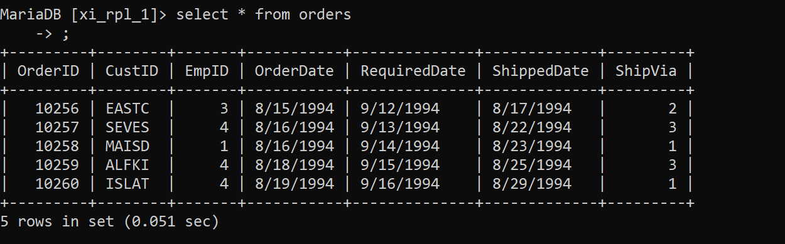

# Susunan Tabel
**Tabel Employees**

**Tabel Orders**

# Query 1

- `SELECT city FROM employees WHERE lastname = 'Callahan'`
- Subquery ini akan mencari dan mengembalikan nilai kota (city) dari karyawan yang memiliki nama belakang (lastname) 'Callahan'.
- Subquery ini hanya akan mengembalikan satu baris/nilai, yaitu kota tempat tinggal karyawan bernama belakang 'Callahan'.

# Query 2

# Query 3

# Query 4

# Query 5
# Query 6
# Query 7
# Query 8
# Query 9
# Query 10
# Query 11
# Query 12
# Query 13
# Query 14
