# AND
## Penjelasan
1. `select` query yang digunakan untuk menampilkan masukan dari `insert`
2. `warna,pemilik` merupakan nama kolom dari mobil
3. `from` query yang digunakan untuk memberi tanda bahwa tabel mana yang akan di tampilak
4. `where` query yang digunakan untuk memberikan sebuah kondisi
5. `warna='hitam' and pemilik='ibrahim'` merupakan sebuah kondisi untuk query dan `and` digunakan untuk memberikan syarat yang keduanya harus di penuhi 
## Struktur Query
```mysql
SELECT kolom1,kolom2 FROM [nama_tabel] WHERE kolom1="nilai1" AND kolom2="nilai2";
```
## Contoh Query
```MYSQL
SELECT warna,pemilik FROM mobil WHERE warna="HITAM" AND pemilik="REZKY";
```
## Hasil
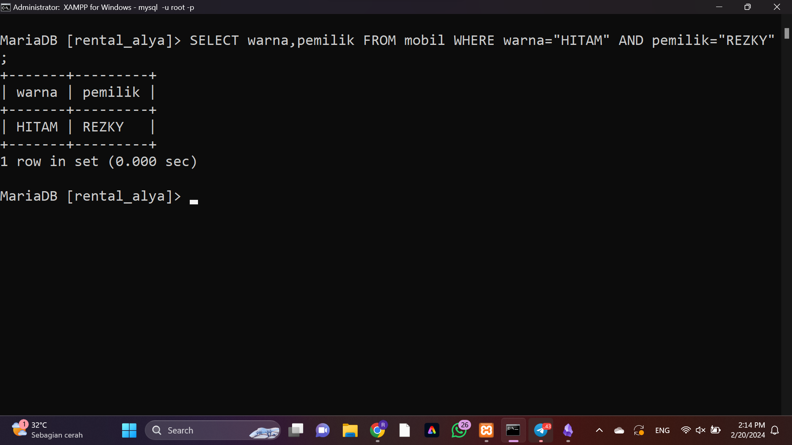
## Kesimpulan
jika ingin menampilakan data yang telah di seleksi dengan cara memberikan syarat yang semuanya harus di penuhi kalian bisa menggunakan query dengan struktur  `select kolom1,kolom2 from nama_table where kolom1='nilai_kolom1' and kolom2='nilai_kolom2';`

# OR
## Penjelasan
1. `select` query yang digunakan untuk menampilkan masukan dari `insert`
2. `warna,pemilik` merupakan nama kolom dari mobil
3. `from` query yang digunakan untuk memberi tanda bahwa tabel mana yang akan di tampilak
4. `where` query yang digunakan untuk memberikan sebuah kondisi
5. `warna='hitam' or pemilik='ibrahim'` merupakan sebuah kondisi untuk query dan `or` digunakan untuk memberikan syarat yang salah satunya harus di penuhi 
## Struktur Query
```MYSQL
 SELECT kolom1,kolom2 FROM [nama_tabel] WHERE kolom1="nilai1" OR kolom2="nilai2";
```
## Contoh Query
```MYSQL
 SELECT warna,pemilik FROM mobil WHERE warna="HITAM" OR pemilik="REZKY";
```
## Hasil
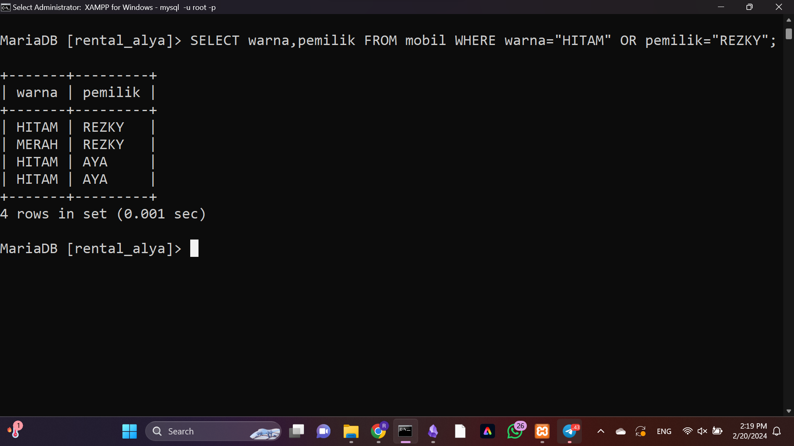
## Kesimpulan
jika kalian ingin menampilakan data tabel dari kolom yang nilainya telah di seleksi dengan cara memberikan syarat yang salah satunya harus di penuhi kalian bisa menggunakan query dengan struktur  `select warna,pemilik from mobil where warna='HITAM' or pemilik='REZKY';`

# BETWEEN
## Penjelasan
1. `select` query yang digunakan untuk menampilkan masukan dari `insert`
2. `*`  berarti semua kolom akan di tampilkan
3. `from` untuk memberikan tanda bahwa table mana yang akan di tampilkan
4. `mobil` nama table yang akan di tampilkan
5. `where` untuk memberikan sebuah kondisi
6. `harga_rental` nama kolom yang digunakan untuk mengkondisikan sebuah table
7. `between` Ini adalah operator yang digunakan untuk memilih rentang nilai
8. `50000 and 100000` Ini adalah nilai rentang yang digunakan dalam kriteria pemilihan data

## Struktur Query
```MYSQL
 SELECT * FROM [nama_tabel] WHERE kolom1 BETWEEN nilai1 AND nilai2;
```
## Contoh Query
```mysql
 SELECT * FROM mobil WHERE harga_rental BETWEEN 50000 AND 100000;
```
## Hasil
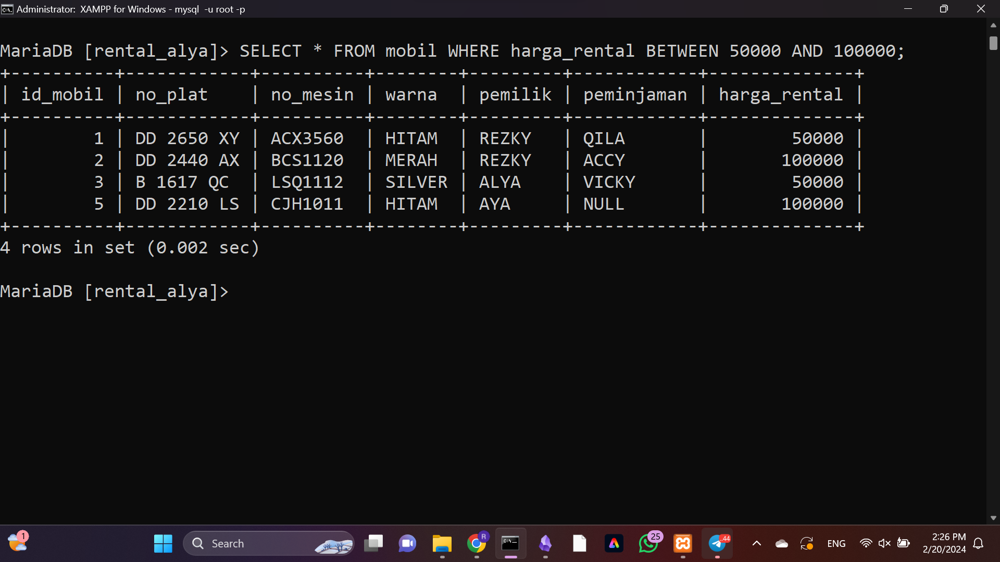
## Kesimpulan
Jika ingin menampilakan hasil dari menyeleksi table dengan cara memberikan sebuah rentang nilai kalian bisa menggunakan sebuah query dengean struktur `select * from nama_table where nama_kolom between nilai1 and nilai2;`

# NOT BETWEEN
## Penjelasan
1. `select` query yang digunakan untuk menampilkan masukan dari `insert`
2. `*`  berarti semua kolom akan di tampilkan
3. `from` untuk memberikan tanda bahwa table mana yang akan di tampilkan
4. `mobil` nama table yang akan di tampilkan
5. `where` untuk memberikan sebuah kondisi
6. `harga_rental` nama kolom yang digunakan untuk mengkondisikan sebuah table
7. `not between` Ini adalah operator yang digunakan untuk memilih nilai di luar rentang tertentu.
8. `100000 and 150000` Ini adalah nilai rentang yang digunakan dalam kriteria pemilihan data
## Struktur Query
```MYSQL
 SELECT * FROM [nama_tabel] WHERE kolom1 NOT BETWEEN nilai1 AND nilai2;
```
## Contoh Query
```MYSQL
 SELECT * FROM mobil WHERE harga_rental NOT BETWEEN 100000 AND 150000;
```
## Hasil
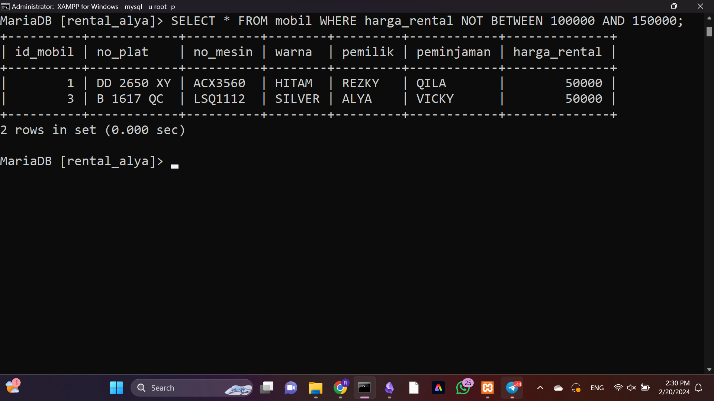
## Kesimpulan
Jika ingin menampilakan hasil dari menyeleksi table dengan cara memberikan sebuah rentang nilai yang beda nya sebelumnya itu jika nilai tersebut masih berada di dalam rentang nilai yang diberikan maka akan di tampilkan sedangkan kali ini di luar dari rentang nilai yang akan di tampilkan untuk itu kalian bisa menggunakan sebuah query dengan struktur `select * from nama_table where nama_kolom not between nilai1 and nilai2;`

# <=
## Penjelasan
1. `select` query yang digunakan untuk menampilkan hasil dari `insert`
2. `*` arti nya semua kolom akan ditampilkan
3. `from` query yang digunakan untuk memberikan penanda bahwa table mana yang akan di tampilkan
4. `mobil` nama table yang akan ditampilkan
5. `where` query yang digunakan untuk memberikan sebuah kondisi
6. `harga_rental<=100000` sebuah kondisi yang telah di berikan dan `harga_rental` itu nama kolom, `<=` merupakan operator, dan `100000`merupakan sebuah nilai.

## Struktur Query
```mysql
 SELECT * FROM [nama_tabel] WHERE kolom1 <= nilai1;
```
## Contoh Query
```mysql
 SELECT * FROM mobil WHERE harga_rental <= 100000;
```
## Hasil
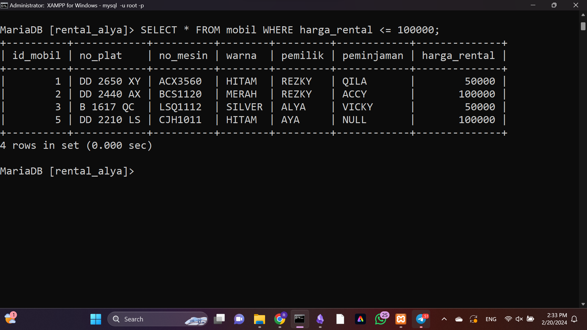
## Kesimpulan
jika ingin menampilkan table dengan menggunakan hasil seleksi yang dimana jika dia lebih kecil dari nilai yang di tentukan maka dia akan tampil, yaitu dengan cara menggunakan query dengan struktur `select * from nama_table where nama_kolom<=nilai;`

# >=
## Penjelasan
1. `select` query yang digunakan untuk menampilkan hasil dari `insert`
2. `*` arti nya semua kolom akan ditampilkan
3. `from` query yang digunkan untuk memberikan penanda bahwa table mana yang akan di tampilkan
4. `mobil` nama table yang akan ditampilkan
5. `where` query yang digunakan untuk memberikan sebuah kondisi
6. `harga_rental>=100000` sebuah kondisi yang telah di berikan dan `harga_rental` itu nama kolom, `>=` merupakan operator, dan `100000`merupakan sebuah nilai

## Struktur Query
```mysql
SELECT * FROM [nama_tabel] WHERE kolom1 >= nilai1;
```
## Contoh Query
```mysql
SELECT * FROM mobil WHERE harga_rental >= 100000;
```
## Hasil
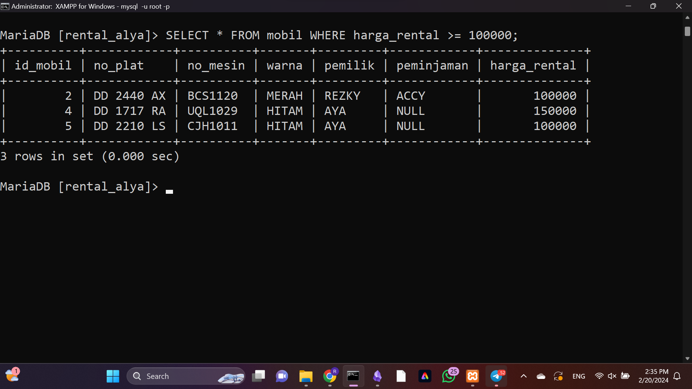
## Kesimpulan
 jika ingin menampilkan table dengan menggunakan hasil seleksi yang dimana jika dia lebih besar dari nilai yang di tentukan maka dia akan tampil, yaitu dengan cara menggunakan query dengan struktur `select * from nama_table where nama_kolom<=nilai;`
# <> atau !=
## Penjelasan
PENJELASAN 1
1. `select` query yang digunakan untuk menampilkan hasil dari `insert`
2. `*` artinya semua kolom akan ditampilkan
3. `from` query yang digunkan untuk memberikan penanda bahwa table mana yang akan di tampilkan
4. `mobil` nama table yang akan ditampilkan
5. `where` query yang digunakan untuk memberikan sebuah kondisi
6. `harga_rental<>100000` sebuah kondisi yang telah di berikan dan `harga_rental` itu nama kolom, `<>` merupakan operator, dan `100000` merupakan sebuah nilai

PENJELASAN 2
1. `select` query yang digunakan untuk menampilkan hasil dari `insert`
2. `*` artinya semua kolom akan ditampilkan
3. `from` query yang digunkan untuk memberikan penanda bahwa table mana yang akan di tampilkan
4. `mobil` nama table yang akan ditampilkan
5. `where` query yang digunakan untuk memberikan sebuah kondisi
6. `harga_rental!=50000` sebuah kondisi yang telah di berikan dan `harga_rental` itu nama kolom, `!=` merupakan operator, dan `50000`merupakan sebuah nilai
## Struktur Query
```mysql
SELECT * FROM [nama_tabel] WHERE kolom1 <> nilai1;

SELECT * FROM [nama_tabel] WHERE kolom1 != nilai1;
```
## Contoh Query
```mysql
SELECT * FROM mobil WHERE harga_rental <> 100000;

SELECT * FROM mobil WHERE harga_rental != 50000;
```
## Hasil
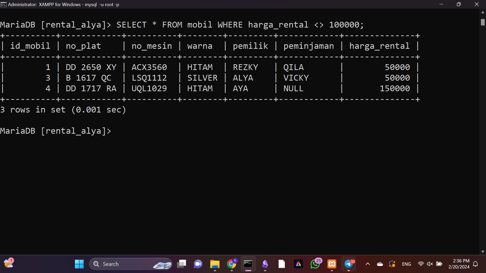

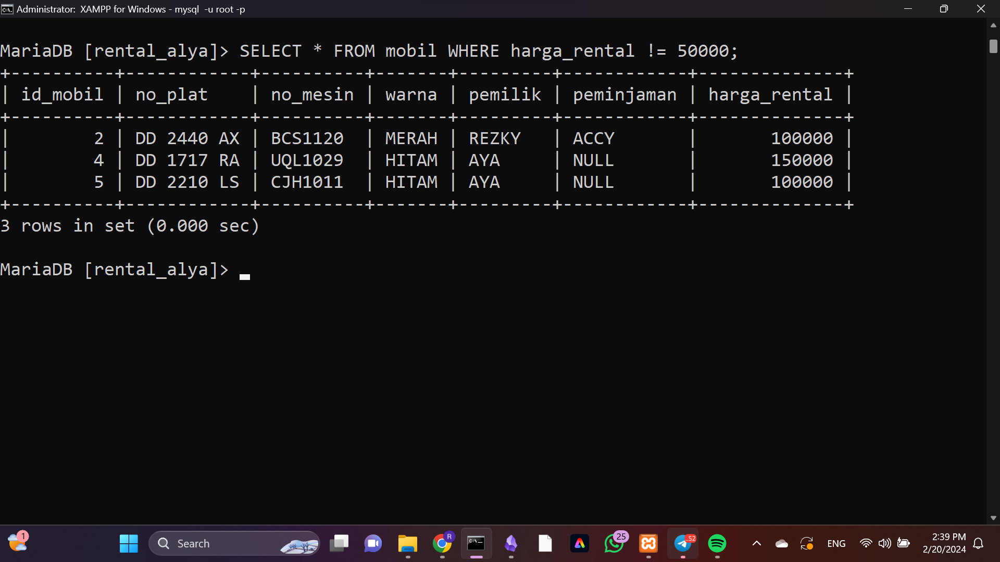
## Kesimpulan
dari kedua contoh operator kita bisa menyimpulkan bahwa operator `!=` dengan `<>` memiliki arti yang sama yang dimana jika ingin menampilkan table dengan menggunakan sebuah nilai maka nilai yang ingin di tampilkan tidak boleh sama dengan nilai yang telah ditentukan.

# Tantangan login
## Penjelasan
`SELECT nama FROM tantangan` : merupakan perintah SQL untuk mencari kolom nama yang berada di tabel tantangan.
`WHERE nama="REZKY AWALYA` : query SQL untuk mencari keberadaan data yang bernama "REZKY AWALYA" yang berada di dalam kolom `nama`.
## Query
```mysql
SELECT nama FROM tantangan
    -> WHERE nama="REZKY AWALYA";
```
## Hasil
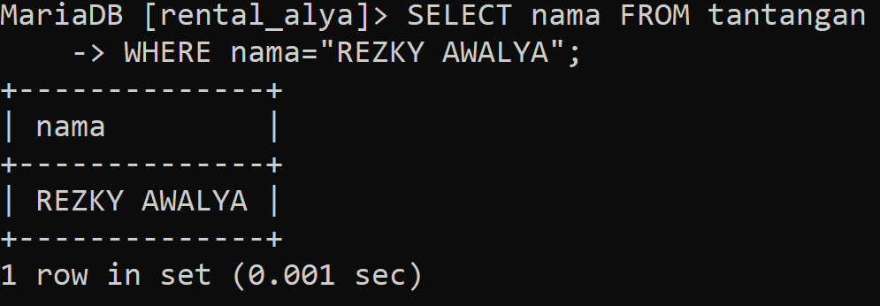
## Kesimpulan
jika ingin menampilkan dari hasil seleksi yang dimana hanya ada satu nilai dari satu kolom atau hanya 1 kolom yang ingin di tampilkan, yaitu dengan cara menggunakan query dengan struktur `select nama_kolom1 from nama_table where nama_kolom2=nilai;`

# IN
## Penjelasan
1. `SELECT *` artinya kita akan mengambil semua kolom dari tabel "mobil".
2. `FROM mobil` artinya kita akan mengambil data dari tabel "mobil".
3. `WHERE warna IN ('Silver', 'Merah')` artinya kita hanya akan mengambil baris-baris yang di mana nilai pada kolom "warna" memiliki nilai "Silver" dan "Merah".
### Struktur Querry
```mysql
SELECT * FROM [nama_tabel] WHERE [nama_kolom] IN("nilai1","nilai2");
```
### Contoh Query
```MYSQL
 SELECT * FROM mobil WHERE warna IN("Silver","Merah");
```
### Hasil
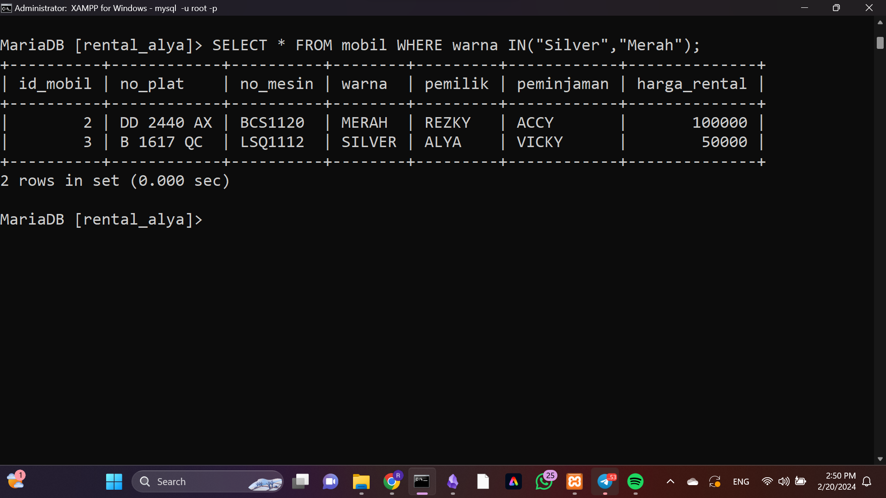
### Kesimpulan
Perintah `SELECT *` digunakan untuk mengambil semua kolom dari tabel "mobil". Selanjutnya, `FROM mobil` menunjukkan bahwa data diambil dari tabel "mobil". Klausa `WHERE warna IN ('Silver', 'Merah')` digunakan untuk memfilter baris-baris di mana nilai kolom "warna" adalah "Silver" atau "Merah". Jadi, query ini akan mengembalikan baris-baris di mana nilai kolom "warna" berisi nilai "Silver" atau "Merah".
# IN + AND
## Penjelasan
1.  `SELECT *` artinya kita akan mengambil semua kolom dari tabel "mobil".
2. `FROM mobil` artinya kita akan mengambil data dari tabel "mobil".
3. `WHERE warna IN ('Silver', 'Merah')` artinya kita hanya akan mengambil baris-baris di mana nilai kolom "warna" adalah "Silver" atau "Merah".
4. `AND harga_rental = 50000` artinya kita hanya akan mengambil baris-baris di mana nilai kolom "harga_rental" adalah 50000.

### Struktur Query
```mysql
  SELECT * FROM [nama_tabel]
-> WHERE [nama_kolom1] IN("nilai1","nilai2")
-> AND [nama_kolom2] = nilai;
```
### Contoh Query
```MYSQL
  SELECT * FROM mobil
-> WHERE warna IN("Silver","Merah")
-> AND harga_rental = 50000;
```
### Hasil
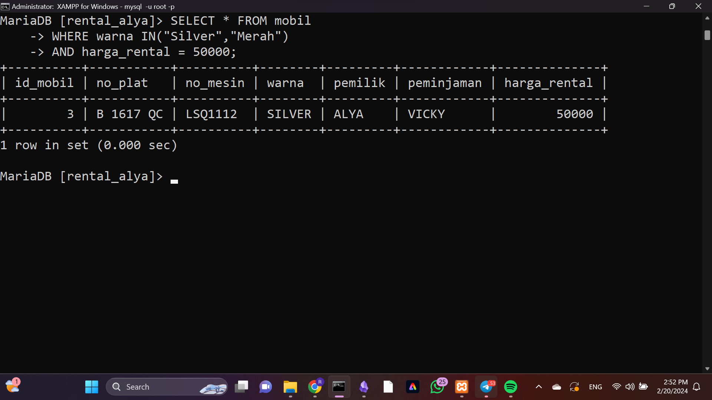
### Kesimpulan
Perintah `SELECT *` digunakan untuk mengambil semua kolom dari tabel "mobil". Selanjutnya, `FROM mobil` menunjukkan bahwa data diambil dari tabel "mobil". Klausa `WHERE warna IN ('Silver', 'Merah')` digunakan untuk memfilter baris-baris di mana nilai kolom "warna" adalah "Hitam" atau "Merah". Selain itu, `AND harga_rental = 50000` digunakan untuk memfilter baris-baris di mana nilai kolom "harga_rental" adalah 50000. Jadi, query ini akan mengembalikan baris-baris di mana nilai kolom "warna" adalah "Silver" atau "Merah", dan nilai kolom "harga_rental" adalah 50000.
# IN + OR
## Penjelasan
- `SELECT *`: Memilih semua kolom dari tabel.
- `FROM mobil`: Menunjukkan bahwa data diambil dari tabel `mobil`.
- `WHERE warna IN ('Hitam', 'Silver') OR harga_rental = 150000`: Menggunakan klausa WHERE untuk memfilter baris berdasarkan kondisi bahwa nilai kolom `warna` adalah 'Hitam' atau 'Silver', atau nilai kolom `harga_rental` adalah 150000.
## Struktur Query
```mysql
SELECT * FROM [nama_tabel]
-> WHERE [nama_kolom1] IN ('nilai1','nilai2')
-> OR [nama_kolom2] = nilai1;
```
## Contoh Query
```MYSQL
SELECT * FROM mobil
-> WHERE warna IN ('Hitam','Silver')
-> OR harga_rental = 150000;
```
## Hasil
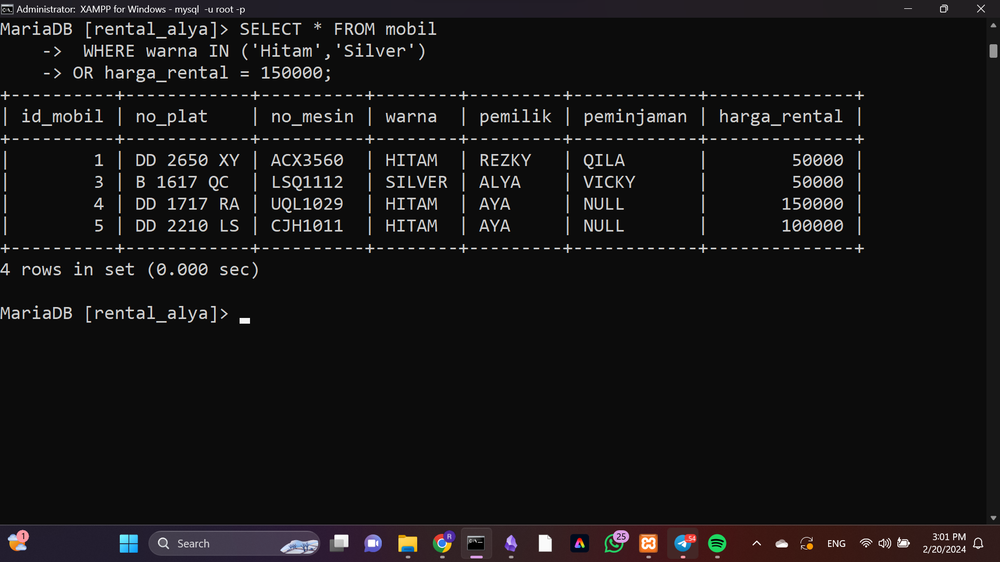
## Kesimpulan
Perintah `SELECT *` digunakan untuk memilih semua kolom dari tabel. Selanjutnya, `FROM mobil` menunjukkan bahwa data diambil dari tabel `mobil`. Klausa `WHERE warna IN ('Hitam', 'Silver') OR harga_rental = 150000` digunakan untuk memfilter baris berdasarkan kondisi bahwa nilai kolom `warna` adalah 'Hitam' atau 'Silver', atau nilai kolom `harga_rental` adalah 150000. Dengan demikian, query ini akan mengembalikan baris-baris di mana nilai kolom `warna` adalah 'Hitam' atau 'Silver', atau nilai kolom `harga_rental` adalah 150000.
## IN + AND + OPERATOR
## Penjelasan
PENJELASAN 1
1. `SELECT *` artinya kita akan mengambil semua kolom dari tabel "mobil".
2. `FROM mobil` artinya kita akan mengambil data dari tabel "mobil".
3. `WHERE warna IN ('Hitam', 'Silver')` artinya kita hanya akan mengambil baris-baris di mana nilai kolom "warna" adalah "Hitam" atau "Silver".
4. `OR harga_rental > 50000` artinya kita juga akan mengambil baris-baris di mana nilai kolom "harga_rental" lebih besar dari 50000.

PENJELASAN 2
1. `SELECT *` artinya kita akan mengambil semua kolom dari tabel "mobil".
2. `FROM mobil` artinya kita akan mengambil data dari tabel "mobil".
3. `WHERE warna IN ('Hitam', 'Silver')` artinya kita hanya akan mengambil baris-baris di mana nilai kolom "warna" adalah "Hitam" atau "Silver".
4. `OR harga_rental < 150000` artinya kita juga akan mengambil baris-baris di mana nilai kolom "harga_rental" kurang dari 150000.
## Struktur Query
```mysql
 SELECT * FROM [nama_tabel]
-> WHERE [nama_kolom1] IN ('nilai1','nilai2')
-> AND [nama_kolom2] > nilai1;

 SELECT * FROM [nama_tabel]
-> WHERE [nama_kolom1] IN ('nilai1','nilai2')
-> AND [nama_kolom2] < nilai1![[tntngan lbih kcil.png]];
```
## Contoh Query
```MYSQL
 SELECT * FROM mobil
-> WHERE warna IN ('Hitam','Silver')
-> AND harga_rental > 50000;

 SELECT * FROM mobil
-> WHERE warna IN ('Hitam','Silver')
-> AND harga_rental < 150000;
```
## Hasil
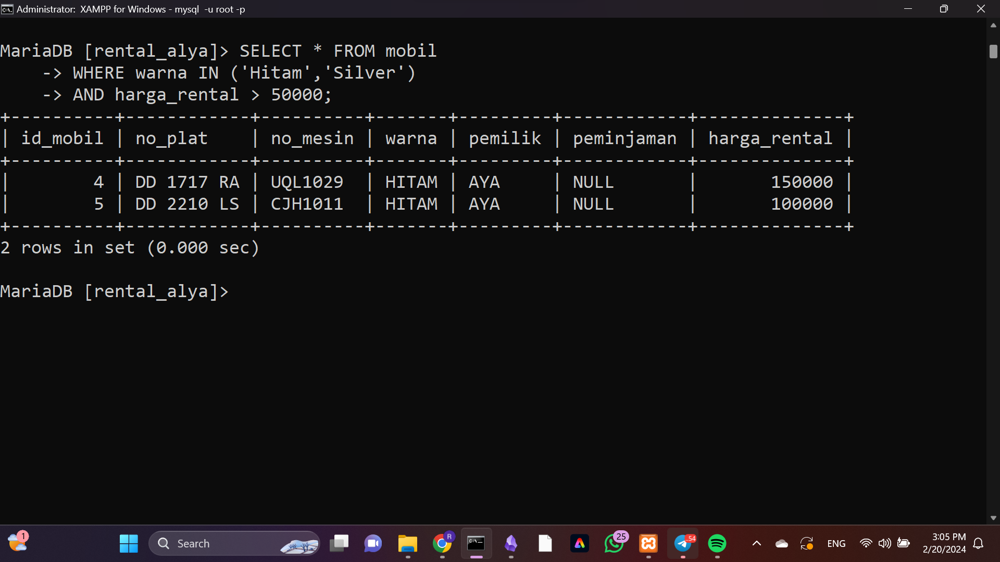

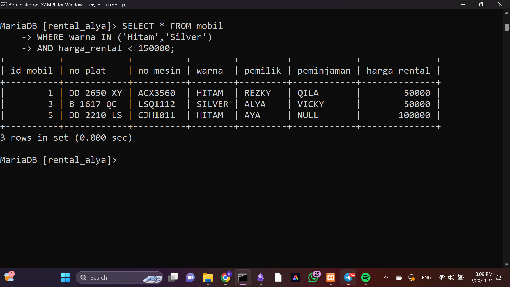
## Kesimpulan
KESIMPULAN 1
Perintah `SELECT *` digunakan untuk mengambil semua kolom dari tabel "mobil". Selanjutnya, `FROM mobil` menunjukkan bahwa data diambil dari tabel "mobil". Klausa `WHERE warna IN ('Hitam', 'Silver')` digunakan untuk memfilter baris-baris di mana nilai kolom "warna" adalah "Hitam" atau "Silver". Selain itu, `OR harga_rental > 50000` digunakan untuk juga memfilter baris-baris di mana nilai kolom "harga_rental" lebih besar dari 50000. Jadi, pernyataan ini akan mengambil baris-baris di mana nilai kolom "warna" adalah "Hitam" atau "Silver", atau di mana nilai kolom "harga_rental" lebih besar dari 50000.

KESIMPULAN 2
Perintah `SELECT *` digunakan untuk mengambil semua kolom dari tabel "mobil". Selanjutnya, `FROM mobil` menunjukkan bahwa data diambil dari tabel "mobil". Klausa `WHERE warna IN ('Hitam', 'Silver')` digunakan untuk memfilter baris-baris di mana nilai kolom "warna" adalah "Hitam" atau "Silver". Selain itu, `OR harga_rental < 150000` digunakan untuk juga memfilter baris-baris di mana nilai kolom "harga_rental" kurang dari 150000. Jadi, pernyataan ini akan mengambil baris-baris di mana nilai kolom "warna" adalah "Hitam" atau "Silver", atau di mana nilai kolom "harga_rental" kurang dari 150000.
# LIKE
## Mencari Awalan
### Penjelasan
1. `SELECT *` artinya kita akan mengambil semua kolom dari tabel "mobil".
2. `FROM mobil` artinya kita akan mengambil data dari tabel "mobil".
3. `WHERE pemilik LIKE 'ay%'` artinya kita hanya akan mengambil baris-baris di mana nilai kolom "pemilik" dimulai dengan kata "ay" (dilanjutkan dengan karakter apa pun, karena simbol `%` dalam pola pencocokan).
### Struktur Query 
```mysql
select * from [nama_tabel]
-> where [nama_kolom] like 'nama_awal%';
```
### Contoh Query
```mysql
select * from mobil
-> where pemilik like 'ay%';
```
### Hasil
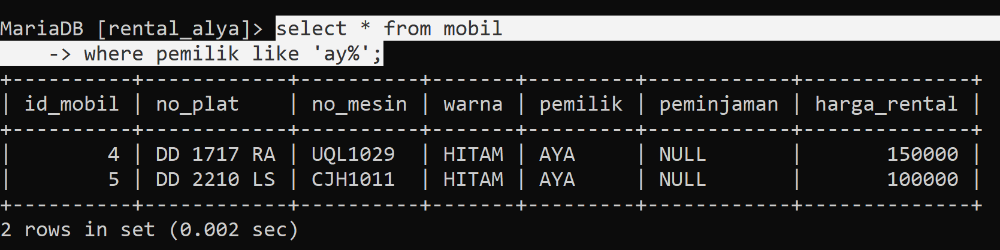
### Kesimpulan
Perintah `SELECT *` digunakan untuk mengambil semua kolom dari tabel "mobil". Selanjutnya, `FROM mobil` menunjukkan bahwa data diambil dari tabel "mobil". Klausa `WHERE pemilik LIKE 'ay%'` digunakan untuk memfilter baris-baris di mana nilai kolom "pemilik" dimulai dengan kata "ay" (dilanjutkan dengan karakter apa pun, karena simbol `%` dalam pola pencocokan). Jadi, pernyataan ini akan mengambil baris-baris di mana nilai kolom "pemilik" memenuhi pola tersebut.
## Mencari Akhiran
### Penjelasan
1. `SELECT *` artinya kita akan mengambil semua kolom dari tabel "mobil".
2. `FROM mobil` artinya kita akan mengambil data dari tabel "mobil".
3. `WHERE pemilik LIKE '%y'` artinya kita hanya akan mengambil baris-baris di mana nilai kolom "pemilik" diakhiri dengan huruf "y" (dimulai dengan karakter apa pun, karena simbol `%` sebelum "m" dalam pola pencocokan).

### Struktur Query 
```mysql
select * from [nama_tabel]
-> where [nama_kolom] like '%nama_akhir';
```
### Contoh Query
```mysql
select * from mobil
-> where pemilik like '%y';
```
### Hasil
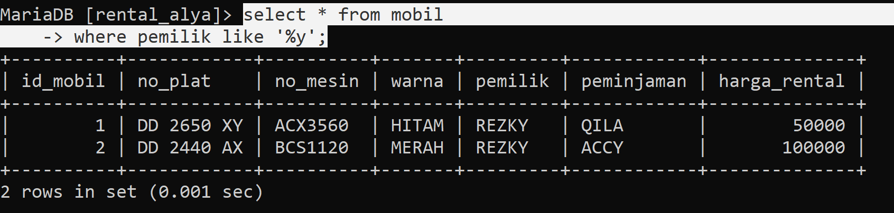
### Kesimpulan
Perintah `SELECT *` digunakan untuk mengambil semua kolom dari tabel "mobil". Selanjutnya, `FROM mobil` menunjukkan bahwa data diambil dari tabel "mobil". Klausa `WHERE pemilik LIKE '%y'` digunakan untuk memfilter baris-baris di mana nilai kolom "pemilik" diakhiri dengan huruf "y" (dimulai dengan karakter apa pun, karena simbol `%` sebelum "y" dalam pola pencocokan). Jadi, pernyataan ini akan mengambil baris-baris di mana nilai kolom "pemilik" memenuhi pola tersebut.
## Mencari Awalan & Akhiran
### Penjelasan
1. `SELECT *` artinya kita akan mengambil semua kolom dari tabel "mobil".
2. `FROM mobil` artinya kita akan mengambil data dari tabel "mobil".
3. `WHERE pemilik LIKE 'a%a'` artinya kita hanya akan mengambil baris-baris di mana nilai kolom "pemilik" dimulai dengan huruf "a", diikuti oleh setidaknya satu karakter apa pun (dilambangkan oleh simbol `%`), dan diakhiri dengan huruf "a".
### Struktur Query 
```mysql
 select * from [nama_tabel]
-> where [nama_kolom] like 'nama_awal%nama_akhir';
```
### Contoh Query
```mysql
 select * from mobil
-> where pemilik like 'a%a';
```
### Hasil
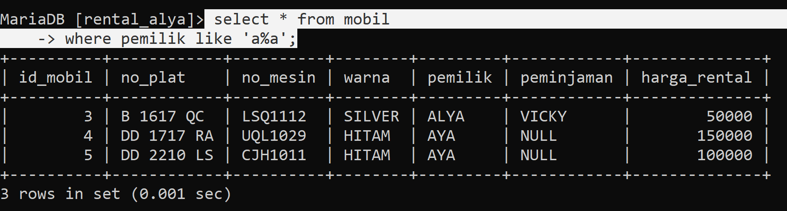
### Kesimpulan
Perintah `SELECT *` digunakan untuk mengambil semua kolom dari tabel "mobil". Selanjutnya, `FROM mobil` menunjukkan bahwa data diambil dari tabel "mobil". Klausa `WHERE pemilik LIKE 'a%a'` digunakan untuk memfilter baris-baris di mana nilai kolom "pemilik" dimulai dengan huruf "a", diikuti oleh setidaknya satu karakter apa pun (dilambangkan oleh simbol `%`), dan diakhiri dengan huruf "a". Jadi, pernyataan ini akan mengambil baris-baris di mana nilai kolom "pemilik" memenuhi pola tersebut.
## Berdasarkan Total Karakter
### Penjelasan
PENJELASAN 1
1. `SELECT *` artinya kita akan mengambil semua kolom dari tabel "mobil".
2. `FROM mobil` artinya kita akan mengambil data dari tabel "mobil".
3. `WHERE pemilik LIKE 'A__'` artinya kita hanya akan mengambil baris-baris di mana nilai kolom "pemilik" terdiri dari 3 karakter, di mana karakter pertama adalah "A" (dilambangkan oleh underscore `_`) dan dua karakter berikutnya adalah karakter apa pun.

PENJELASAN 2
1. `SELECT *` artinya kita akan mengambil semua kolom dari tabel "mobil".
2. `FROM mobil` artinya kita akan mengambil data dari tabel "mobil".
3. `WHERE pemilik LIKE '___'` artinya kita hanya akan menampilakan sebuah tabel dengan syarat nilai pemilik harus memiliki 3 huruf
### Struktur Query
```mysql
select * from [nama_tabel]
	-> Where [nama_kolom] LIKE 'awalan+_sesuaijumlahkarakter';

select * from [nama_tabel]
    -> Where [nama_kolom] LIKE '_sesuaijumlahkarakter';
```
### Contoh Query
```mysql
select * from mobil
	-> Where pemilik LIKE 'A___';

select * from mobil
    -> Where pemilik LIKE '___';
```
### Hasil
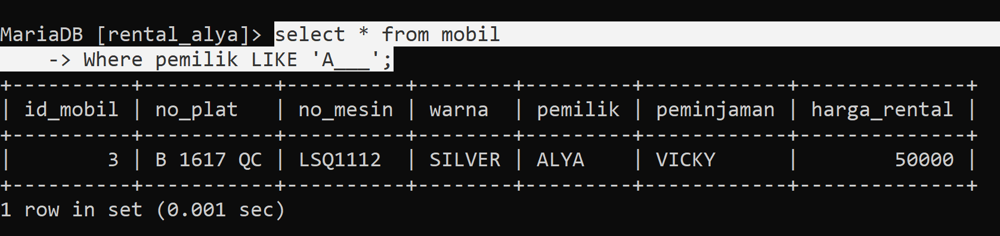
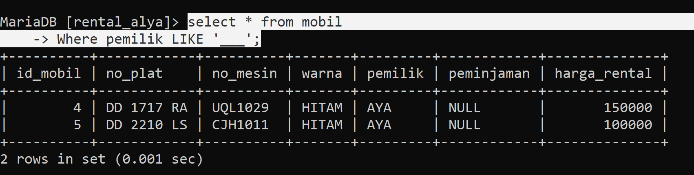
### Kesimpulan
KESIMPULAN 1
Perintah `SELECT *` digunakan untuk mengambil semua kolom dari tabel "mobil". Selanjutnya, `FROM mobil` menunjukkan bahwa data diambil dari tabel "mobil". Klausa `WHERE pemilik LIKE 'A__'` digunakan untuk memfilter baris-baris di mana nilai kolom "pemilik" terdiri dari 3 karakter, di mana karakter pertama adalah "IA (dilambangkan oleh underscore `_`) dan dua karakter berikutnya adalah karakter apa pun. Jadi, pernyataan ini akan mengambil baris-baris di mana nilai kolom "pemilik" memenuhi pola tersebut.

KESIMPULAN 2
Perintah `SELECT *` digunakan untuk mengambil semua kolom dari tabel "mobil". Selanjutnya, `FROM mobil` menunjukkan bahwa data diambil dari tabel "mobil". Klausa `WHERE pemilik LIKE '___'` digunakan untuk menampilkan tabel dengan syarat nilai kolom "pemilik" harus memiliki tepat 3 huruf. Jadi, pernyataan ini akan menampilkan baris-baris di mana nilai kolom "pemilik" memiliki tepat 3 huruf.
## Kombinasi
### Penjelasan
PENJELASAN 1
1. `SELECT *` artinya kita akan mengambil semua kolom dari tabel "mobil".
2. `FROM mobil` artinya kita akan mengambil data dari tabel "mobil".
3. `WHERE pemilik LIKE '__y%'` artinya kita hanya akan mengambil baris-baris di mana nilai kolom "pemilik" terdiri dari setidaknya 3 karakter, di mana dua karakter pertama adalah karakter apa pun (dilambangkan oleh dua underscore `_`), karakter ketiga adalah "y", dan karakter-karakter berikutnya adalah karakter apa pun (dilambangkan oleh simbol `%`).

PENJELASAN 2
1. `SELECT *` artinya kita akan mengambil semua kolom dari tabel "mobil".
2. `FROM mobil` artinya kita akan mengambil data dari tabel "mobil".
3. `WHERE pemilik LIKE '__a%'` artinya kita hanya akan mengambil baris-baris di mana nilai kolom "pemilik" terdiri dari setidaknya 3 karakter, di mana karakter pertama adalah karakter apa pun (dilambangkan oleh satu underscore `_`), karakter ketiga adalah "a", dan karakter-karakter berikutnya adalah karakter apa pun (dilambangkan oleh simbol `%`).
### Struktur Query
```mysql
select * from mobil
    -> Where pemilik LIKE 'A%___';

select * from mobil
    -> Where pemilik LIKE '__a%';
```
### Contoh Query
```mysql
select * from mobil
    -> Where pemilik LIKE '__y%';
    
select * from mobil
    -> Where pemilik LIKE '__a%';
```
### Hasil
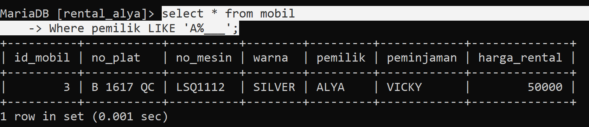

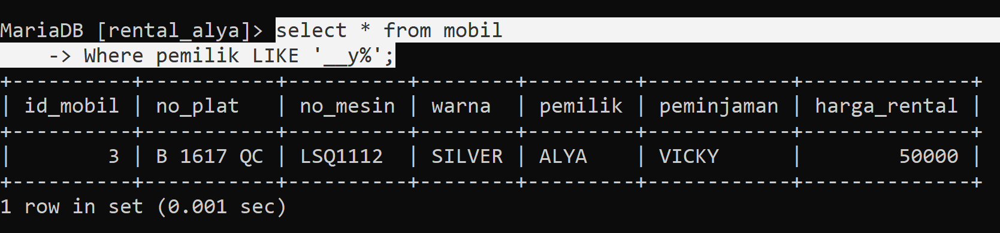

### Kesimpulan
KESIMPULAN 1
Perintah `SELECT *` digunakan untuk mengambil semua kolom dari tabel "mobil". Selanjutnya, `FROM mobil` menunjukkan bahwa data diambil dari tabel "mobil". Klausa `WHERE pemilik LIKE '__y%'` digunakan untuk memfilter baris-baris di mana nilai kolom "pemilik" terdiri dari setidaknya 3 karakter, di mana dua karakter pertama adalah karakter apa pun (dilambangkan oleh dua underscore `_`), karakter ketiga adalah "y", dan karakter-karakter berikutnya adalah karakter apa pun (dilambangkan oleh simbol `%`). Jadi, pernyataan ini akan mengambil baris-baris di mana nilai kolom "pemilik" memenuhi pola tersebut.

KESIMPULAN 2
Perintah `SELECT *` digunakan untuk mengambil semua kolom dari tabel "mobil". Selanjutnya, `FROM mobil` menunjukkan bahwa data diambil dari tabel "mobil". Klausa `WHERE pemilik LIKE '__a%'` digunakan untuk memfilter baris-baris di mana nilai kolom "pemilik" terdiri dari setidaknya 2 karakter, di mana karakter pertama adalah karakter apa pun (dilambangkan oleh satu underscore `_`), karakter ketiga adalah "a", dan karakter-karakter berikutnya adalah karakter apa pun (dilambangkan oleh simbol `%`). Jadi, pernyataan ini akan mengambil baris-baris di mana nilai kolom "pemilik" memenuhi pola tersebut.
## NOT LIKE

### Penjelasan
1. `SELECT *`: Memilih semua kolom dari tabel 'mobil'.
2. `FROM mobil`: Menentukan tabel yang digunakan untuk mengambil data, dalam hal ini tabel 'mobil'.
3. `WHERE peminjam NOT LIKE 'A%'`: Menggunakan klausa WHERE untuk memfilter baris-baris yang akan diambil. Kondisi `peminjam NOT LIKE 'A%'` digunakan untuk memeriksa apakah nilai kolom 'peminjam' tidak dimulai dengan huruf 'A'. Operator `NOT LIKE` digunakan untuk memeriksa apakah nilai tidak cocok dengan pola yang diberikan, dalam hal ini, pola 'A%' berarti dimulai dengan 'A'. Jadi, pernyataan ini akan mengembalikan baris-baris di mana nilai kolom 'peminjam' tidak dimulai dengan huruf 'A'.
### Struktur Query
```mysql
 select * from [nama_tabel]
-> where [nama_kolom] NOT LIKE 'nama_awal%/%nama_akhir';
```
### Contoh Query
```mysql
 select * from mobil
-> where pemilik NOT LIKE 'A%';
```
### Hasil
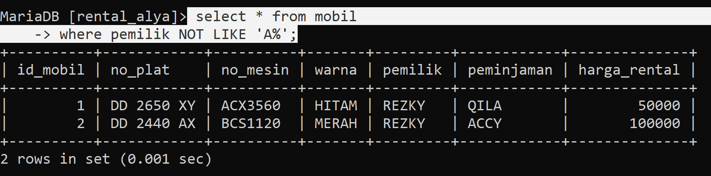
### Kesimpulan
Perintah `SELECT *` digunakan untuk memilih semua kolom dari tabel 'mobil'. Selanjutnya, `FROM mobil` menunjukkan tabel yang digunakan untuk mengambil data, yaitu tabel 'mobil'. Klausa `WHERE peminjam NOT LIKE 'A%'` digunakan untuk memfilter baris-baris yang akan diambil. Kondisi `peminjam NOT LIKE 'A%'` memeriksa apakah nilai kolom 'peminjam' tidak dimulai dengan huruf 'A'. Operator `NOT LIKE` digunakan untuk memeriksa apakah nilai tidak cocok dengan pola yang diberikan; dalam hal ini, pola 'A%' berarti dimulai dengan 'A'. Jadi, pernyataan ini akan mengembalikan baris-baris di mana nilai kolom 'peminjam' tidak dimulai dengan huruf 'A'.
# NULL & NOT NULL
## Mencari data kosong
### Penjelasan
1. `SELECT *`: Memilih semua kolom dari tabel 'mobil'.
2. `FROM mobil`: Menentukan tabel yang digunakan untuk mengambil data, yaitu tabel 'mobil'.
3. `WHERE peminjam IS NULL`: Menggunakan klausa WHERE untuk memfilter baris-baris yang akan diambil. Kondisi `peminjam IS NULL` digunakan untuk memeriksa apakah nilai kolom 'peminjam' adalah NULL. Operator `IS NULL` digunakan untuk memeriksa apakah nilai kolom adalah NULL.

### Struktur Query
```mysql
select * from mobil
    -> where peminjaman is null;
```
### Contoh Query
```mysql
select * from mobil
    -> where peminjaman is null;
```
### Hasil
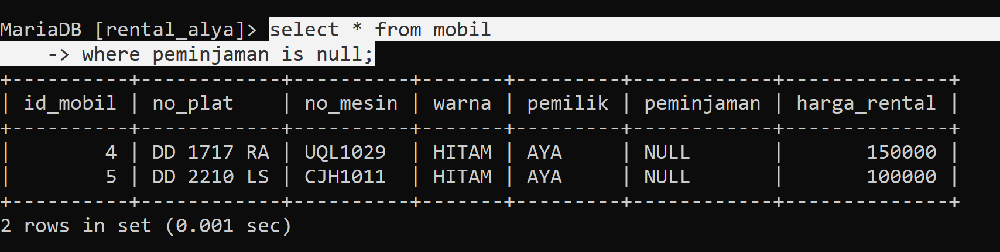

### Kesimpulan
Perintah `SELECT *` digunakan untuk memilih semua kolom dari tabel 'mobil'. Kemudian, `FROM mobil` menunjukkan tabel yang digunakan untuk mengambil data, yaitu tabel 'mobil'. Selanjutnya, `WHERE peminjam IS NULL` menggunakan klausa WHERE untuk memfilter baris-baris yang akan diambil. Kondisi `peminjam IS NULL` digunakan untuk memeriksa apakah nilai kolom 'peminjam' adalah NULL. Operator `IS NULL` digunakan untuk memeriksa apakah nilai kolom adalah NULL. Dengan demikian, query ini akan mengembalikan baris-baris di mana kolom 'peminjam' memiliki nilai NULL.
## Mencari data yang tidak kosong
### Penjelasan
1. `SELECT *`: Memilih semua kolom dari tabel.
2. `FROM mobil`: Menunjukkan bahwa data diambil dari tabel `mobil`.
3. `WHERE peminjam IS NOT NULL`: Menggunakan klausa WHERE untuk memfilter baris berdasarkan kondisi bahwa nilai kolom `peminjam` tidak NULL.
### Struktur Query
```mysql
select * from mobil
    -> where peminjaman is not null;
```
### Contoh Query
```mysql
select * from mobil
    -> where peminjaman is not null;
```
### Hasil
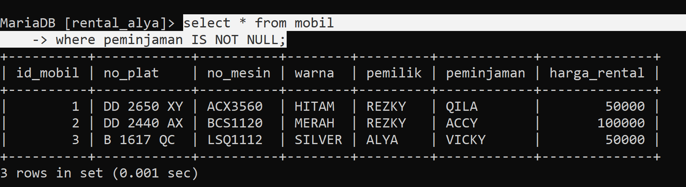
### Kesimpulan
Perintah SQL `SELECT * FROM mobil WHERE peminjaman IS NOT NULL;` digunakan untuk mengambil semua baris dari tabel "mobil" di mana kolom "peminjaman" memiliki nilai yang tidak `NULL`. Dengan kata lain, perintah ini mengambil data mobil yang sedang dipinjam atau sudah dipinjam dari tabel tersebut.
# ORDER BY & LIMIT
## Mengurutkan data dari data terkecil
### Penjelasan
1. `SELECT *`: Memilih semua kolom dari tabel 'mobil'.
2. `FROM mobil`: Menunjukkan tabel yang digunakan untuk mengambil data, yaitu tabel 'mobil'.
3. `ORDER BY pemilik ASC`: Menggunakan klausa ORDER BY untuk mengurutkan hasil query berdasarkan kolom 'pemilik' secara ascending (ASC). Ini berarti data akan diurutkan dari nilai paling rendah ke nilai paling tinggi berdasarkan abjad.
### Struktur Query
```mysql
select * from [nama_tabel]
    -> ORDER BY [nama_kolom] ASC;
```
### Contoh Query
```mysql
select * from mobil
    -> ORDER BY pemilik ASC;
```
### Hasil
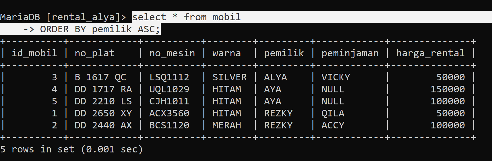

### Kesimpulan
 Perintah `SELECT *` digunakan untuk memilih semua kolom dari tabel 'mobil'. Kemudian, `FROM mobil` menunjukkan tabel yang digunakan untuk mengambil data, yaitu tabel 'mobil'. Selanjutnya, `ORDER BY pemilik ASC` menggunakan klausa ORDER BY untuk mengurutkan hasil query berdasarkan kolom 'pemilik' secara ascending (ASC), yang berarti data akan diurutkan dari nilai paling rendah ke nilai paling tinggi berdasarkan abjad.
## Mengurutkan data dari yang terbesar
### Penjelasan
1. `SELECT *`: Memilih semua kolom dari tabel 'mobil'.
2. `FROM mobil`: Menunjukkan tabel yang digunakan untuk mengambil data, yaitu tabel 'mobil'.
3. `ORDER BY pemilik DESC`: Menggunakan klausa ORDER BY untuk mengurutkan hasil query berdasarkan kolom 'pemilik' secara descending (DESC). Ini berarti data akan diurutkan dari nilai paling tinggi ke nilai paling rendah berdasarkan abjad.
### Struktur Query
```mysql
select * from [nama_tabel]
    -> ORDER BY [nama_kolom] DESC;
```
### Contoh Query
```mysql
select * from mobil
    -> ORDER BY pemilik DESC;
```

### Hasil
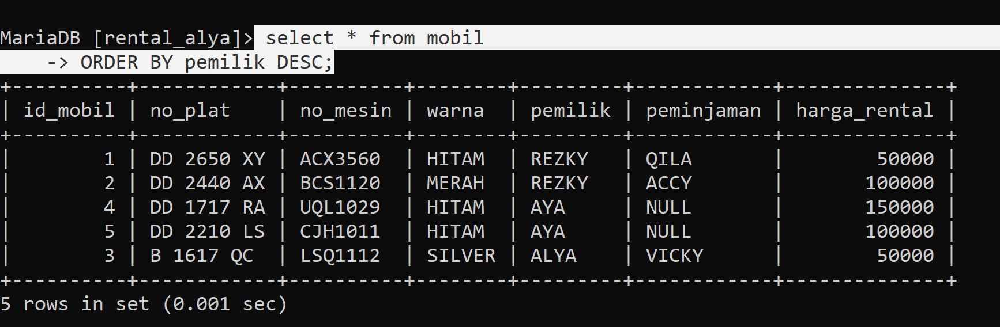

### Kesimpulan
Perintah `SELECT *` digunakan untuk memilih semua kolom dari tabel 'mobil'. Kemudian, `FROM mobil` menunjukkan tabel yang digunakan untuk mengambil data, yaitu tabel 'mobil'. Selanjutnya, `ORDER BY peminjam DESC` menggunakan klausa ORDER BY untuk mengurutkan hasil query berdasarkan kolom 'peminjam' secara descending (DESC), yang berarti data akan diurutkan dari nilai paling tinggi ke nilai paling rendah berdasarkan abjad.
## Membatasi data yang tampil
### Penjelasan
Query `SELECT * FROM daftar_mobil WHERE warna = "hitam" ORDER BY harga_rental ASC LIMIT 2;` menampilkan semua kolom dari tabel "daftar_mobil" di mana kolom "warna" bernilai "hitam", lalu akan diurutkan berdasarkan kolom "harga_rental" secara ascending (dari yang terendah ke tertinggi), dan akan dibatasi hanya menampilkan 2 baris data.
### Struktur Query
```mysql
SELECT * FROM (nama_tabel) WHERE (nama_kolom = "nilai" ORDER BY (nama_kolom) ASC LIMIT 2;
```
### Contoh Query
```MYSQL
SELECT * FROM daftar_mobil WHERE warna = "hitam" ORDER BY harga_rental ASC LIMIT 2;
```
### Hasil
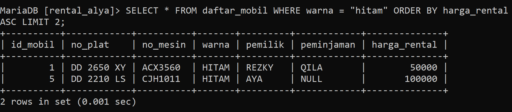
### Kesimpulan
query `SELECT * FROM daftar_mobil WHERE warna = "hitam" ORDER BY harga_rental ASC LIMIT 2;` akan menampilkan informasi 2 mobil berwarna hitam dengan harga rental terendah dari tabel "daftar_mobil".
# DISTINCT
## Penjelasan
untuk menyeleksi data yang duplikat

PENJELASAN 1
1. `SELECT DISTINCT(pemilik)`: Memilih nilai unik dari kolom 'pemilik'. Penggunaan `DISTINCT` menghilangkan duplikat dan hanya mengembalikan nilai unik.
2. `FROM mobil`: Menunjukkan bahwa data diambil dari tabel 'mobil'.

PENJELASAN 2
1. `SELECT DISTINCT(harga_rental)`: Memilih nilai unik dari kolom 'harga_rental'. `DISTINCT` digunakan untuk menghilangkan nilai yang sama dan hanya mengembalikan nilai yang unik.
2. `FROM mobil`: Menunjukkan bahwa data diambil dari tabel 'mobil'.
3. `ORDER BY harga_rental DESC`: Mengurutkan hasil berdasarkan kolom 'harga_rental' secara descending. Ini berarti data akan diurutkan dari nilai tertinggi ke terendah berdasarkan harga rental.
## Struktur Query
```mysql
SELECT DISTINCT[(nama_kolom)] FROM [nama_tabel];

SELECT DISTINCT[(nama_kolom)] FROM [nama_tabel] ORDER BY ]nama_kolom] DESC;
```
## Contoh Query
```mysql
SELECT DISTINCT(pemilik) FROM mobil;

SELECT DISTINCT(harga_rental) FROM mobil ORDER BY harga_rental DESC;
```
## Hasil
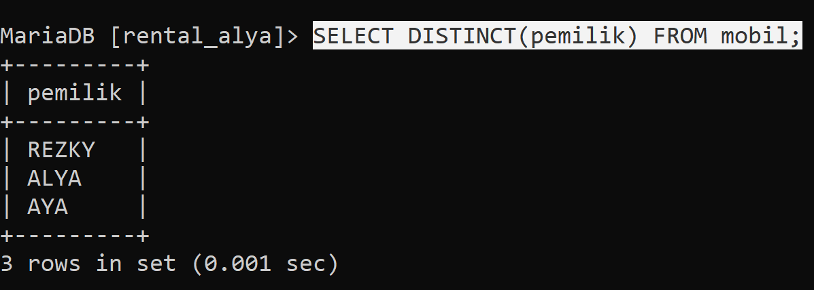
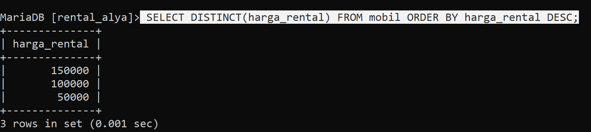

## Kesimpulan
KESIMPULAN 1
Perintah `SELECT DISTINCT(pemilik)` digunakan untuk memilih nilai unik dari kolom 'pemilik'. Dengan menggunakan `DISTINCT`, duplikat dihilangkan sehingga hanya nilai unik yang akan dikembalikan. Selanjutnya, `FROM mobil` menunjukkan bahwa data diambil dari tabel 'mobil'.

KESIMPULAN 2
Perintah `SELECT DISTINCT(harga_rental)` digunakan untuk memilih nilai unik dari kolom 'harga_rental'. Penggunaan `DISTINCT` menghilangkan nilai yang sama dan hanya mengembalikan nilai yang unik. Selanjutnya, `FROM mobil` menunjukkan bahwa data diambil dari tabel 'mobil'. Kemudian, `ORDER BY harga_rental DESC` mengurutkan hasil berdasarkan kolom 'harga_rental' secara descending, artinya data akan diurutkan dari nilai tertinggi ke terendah berdasarkan harga rental.
# CONCAT, CONCAT_WS, AS
## Menggabungkan kolom tanpa pemisah
### Penjelasan
1. `SELECT CONCAT(pemilik, warna)`: Menggunakan fungsi CONCAT() untuk menggabungkan nilai dari kolom 'pemilik' dan 'warna' menjadi satu nilai. Hasilnya akan berupa nilai yang merupakan penggabungan dari nilai 'pemilik' dan 'warna' tanpa ada pemisah di antaranya.
2. `FROM mobil`: Menunjukkan bahwa data diambil dari tabel 'mobil'.
### Struktur Query
```mysql
SELECT CONCAT(nama_kolom) FROM nama_tabel;
```
### Contoh Query
```mysql
SELECT CONCAT(pemilik,warna) FROM mobil;
```
### Hasil
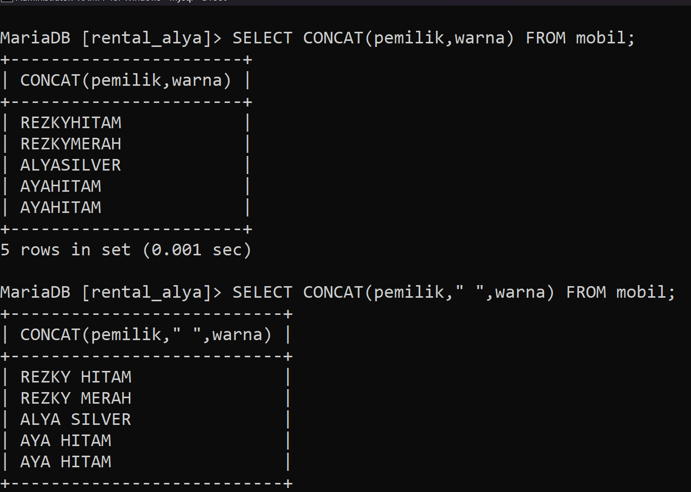

### Kesimpulan
query `SELECT CONCAT(pemilik,warna) FROM mobil;` akan menghasilkan satu kolom yang berisi informasi kombinasi antara pemilik dan warna mobil dari tabel "mobil".
## Menggabungkan kolom dengan pemisah
### Penjelasan
1. `SELECT CONCAT_WS("-", no_plat, no_mesin, id_mobil)`: Menggunakan fungsi CONCAT_WS() untuk menggabungkan nilai dari kolom 'no_plat', 'no_mesin', dan 'id_mobil' dengan pemisah "-" di antara setiap nilai.
2. `FROM mobil`: Menunjukkan bahwa data diambil dari tabel 'mobil'.
### Struktur Query
```mysql
SELECT CONCAT_WS("-",nama2_kolom) FROM nama_tabel;
```
### Contoh Query
```mysql
SELECT CONCAT_WS("-",no_plat,no_mesin,id_mobil) FROM mobil;
```
### Hasil
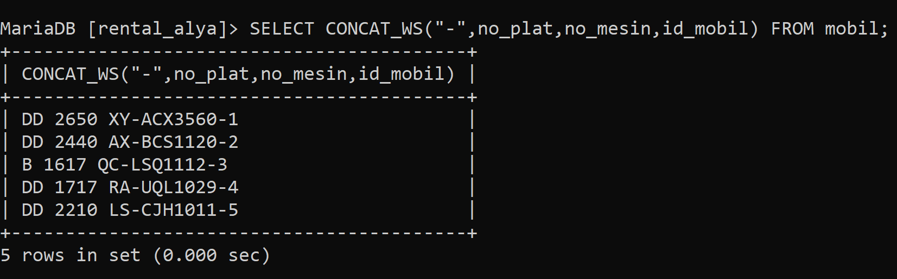

### Kesimpulan
 Perintah `SELECT CONCAT_WS("-", no_plat, no_mesin, id_mobil)` menggabungkan nilai dari kolom 'no_plat', 'no_mesin', dan 'id_mobil' dengan menggunakan fungsi CONCAT_WS(), di mana setiap nilai dipisahkan oleh tanda "-". Selanjutnya, query tersebut menunjukkan bahwa data diambil dari tabel 'mobil'.
## Memberikan nama kolom alias
### Penjelasan
1. `SELECT CONCAT_WS("+", pemilik, peminjam) AS COLLAB`: Menggunakan fungsi CONCAT_WS() untuk menggabungkan nilai dari kolom 'pemilik' dan 'peminjam' dengan pemisah "+" di antara setiap nilai. Hasilnya diberi alias 'COLLAB'.
2. `FROM mobil`: Menunjukkan bahwa data diambil dari tabel 'mobil'.
### Struktur Query
```mysql
SELECT CONCAT_WS("+",nama2_kolom) AS nama_kolom_baru FROM nama_tabel;
```
### Contoh Query
```mysql
SELECT CONCAT_WS("+",pemilik,peminjaman) AS COLLAB FROM mobil;
```
### Hasil
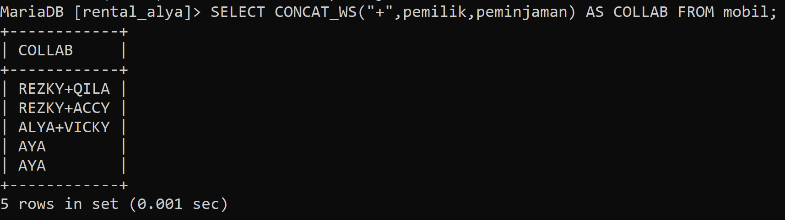

### Kesimpulan
query `SELECT CONCAT_WS("+",pemilik,peminjaman) AS COLLAB FROM mobil;` akan menghasilkan satu kolom baru bernama "COLLAB" yang berisi informasi kombinasi antara pemilik dan peminjaman mobil, dengan pemisah berupa tanda "+" (plus).
# VIEW
## Membuat tabel virtual
### Penjelasan
1. `CREATE VIEW info_no_plat AS`: Perintah ini digunakan untuk membuat view baru dengan nama `info_no_plat`.
2. `SELECT id_mobil, no_plat, pemilik, peminjam FROM mobil WHERE pemilik = "REZKY";`: Ini adalah query yang akan menjadi isi dari view `info_no_plat`. Query ini mengambil kolom `id_mobil`, `no_plat`, `pemilik`, dan `peminjam` dari tabel `mobil` hanya untuk baris-baris di mana `pemilik` adalah "REZKY".
### Struktur Query
```mysql
CREATE VIEW nama_kolom_baru AS
-> SELECT nama2_kolom
-> FROM nama_tabel;
-> WHERE nama_kolom = isi_kolom;
```
### Contoh Query
```mysql
CREATE VIEW info_no_plat AS
-> SELECT id_mobil, no_plat, pemilik, peminjaman
-> FROM mobil
-> WHERE pemilik = "REZKY";
```
### Hasil
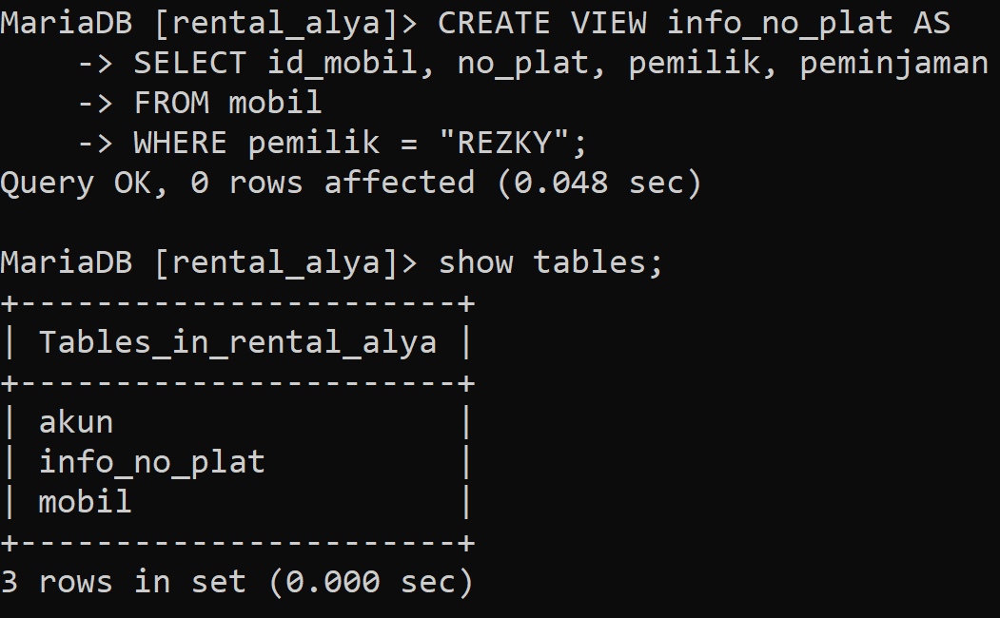

### Kesimpulan
Perintah `CREATE VIEW info_no_plat AS` digunakan untuk membuat view baru dengan nama `info_no_plat`, sedangkan query `SELECT id_mobil, no_plat, pemilik, peminjam FROM mobil WHERE pemilik = "REZKY";` akan menjadi isi dari view tersebut. Query tersebut mengambil kolom `id_mobil`, `no_plat`, `pemilik`, dan `peminjam` dari tabel `mobil` hanya untuk baris-baris di mana nilai kolom `pemilik` adalah "REZKY".
## Menampilkan tabel virtual
### Penjelasan
- `SELECT *` berarti memilih semua kolom yang ada di dalam tabel.
- `FROM info_no_plat` menentukan tabel yang akan diambil datanya, yaitu tabel `info_no_plat`.
### Struktur Query
```mysql
SELECT * FROM nama_tabel_baru;
```

### Contoh Query
```mysql
SELECT * FROM info_no_plat;
```
### Hasil
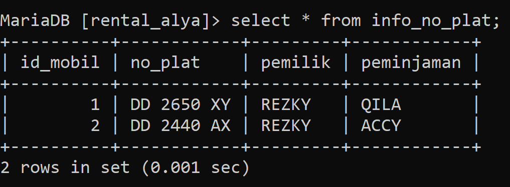

### Kesimpulan
Query `SELECT * FROM info_no_plat;` akan mengembalikan semua data yang ada di dalam tabel `info_no_plat`, dengan menampilkan semua kolom yang tersedia di dalam tabel tersebut. Tabel `info_no_plat` mungkin berisi informasi terkait nomor plat kendaraan, seperti jenis kendaraan, pemilik, tanggal registrasi, dan informasi lainnya.
## Menghapus tabel virtual
### Penjelasan
- `DROP VIEW`: Ini adalah perintah untuk menghapus view.
- `info_no_plat`: Nama view yang akan dihapus.
### Struktur Query
```mysql
DROP VIEW nama_tabel_baru;
```
### Contoh Query
```mysql
DROP VIEW info_no_plat;
```
### Hasil
BEFORE
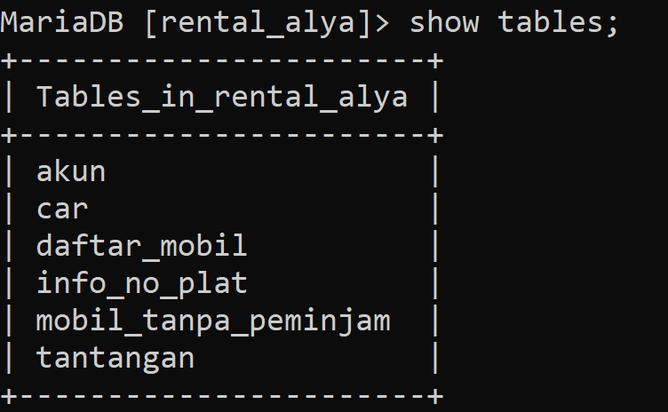
AFTER
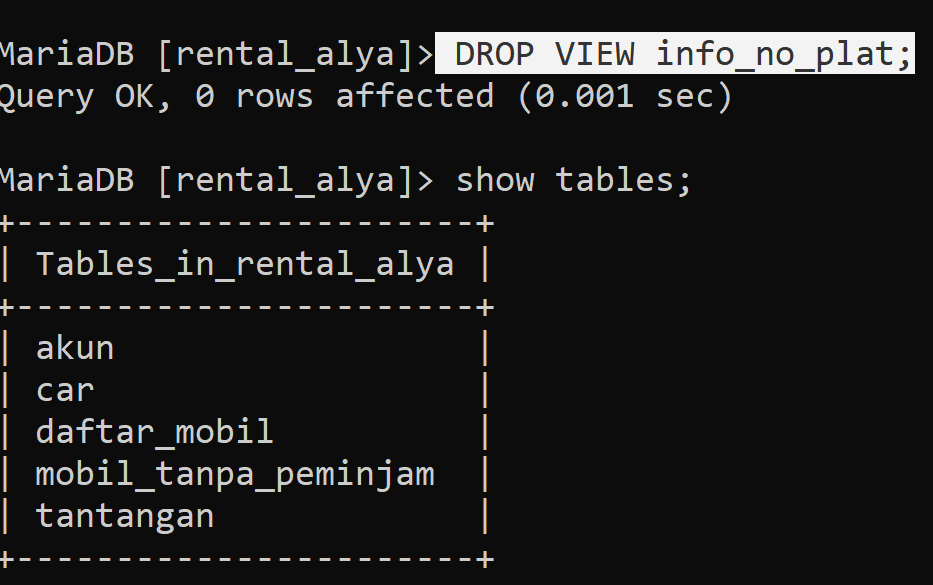
### Kesimpulan
Perintah ini digunakan untuk menghapus view dengan nama `info_no_plat` dari database. Ketika perintah ini dijalankan, view tersebut akan dihapus dan tidak akan lagi tersedia untuk digunakan. Ini memungkinkan Anda untuk membersihkan definisi view yang tidak lagi diperlukan dari database Anda.
# Tantangan View
## Nomor 1
### Penjelasan
`CREATE VIEW mobil_tanpa_peminjam AS` : adalah perintah untuk membuat sebuah view baru atau seperti tabel baru dalam basis data dengan nama mobil_tanpa_peminjam.
- `SELECT no_plat, peminjaman` : adalah perintah untuk memilih dua kolom, yaitu no_plat dan peminjam, dari tabel mobil.
- `FROM mobil` : Menunjukkan bahwa data diambil dari tabel bernama mobil.
- `WHERE peminjam IS NULL` :  adalah klausa WHERE yang mencari baris-baris dari tabel mobil dimana nilai kolom peminjam adalah NULL.

- SELECT *: adalah perintah untuk memilih semua kolom dari view atau tabel.
- FROM mobil_Tanpa_peminjam: Menunjukkan bahwa data diambil dari view yang disebut mobil_Tanpa_peminjam, yang telah dibuat sebelumnya.

### Query
```mysql
CREATE VIEW
    -> mobil_tanpa_peminjam AS
    -> SELECT no_plat,peminjaman
    -> FROM mobil
    -> WHERE peminjaman IS NULL;
```
### Hasil
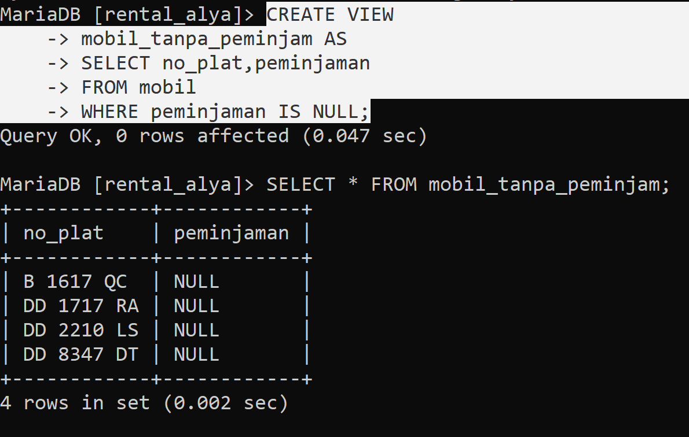
### Kesimpulan
CREATE VIEW mobil_tanpa_peminjam AS Select no_plat, peminjaman FROM mobil WHERE peminjaman IS NULL; digunakan untuk membuat sebuah view baru bernama mobil_Tanpa_peminjam. Viewnya berisi dua kolom, yaitu no_plat dan peminjaman, yang diambil dari tabel mobil hanya baris-baris yang memiliki nilai NULL pada kolom peminjam yang dimasukkan ke dalam view. 

SELECT * FROM mobil_tanpa_peminjam; digunakan untuk menampilkan semua data dari view mobil_Tanpa_peminjam, yang telah dibuat sebelumnya dengan kriteria yang bernilai NULL.
## Nomor 2
### Penjelasan
UPDATE mobil: adalah perintah untuk memperbarui data dalam tabel yang disebut mobil.
- SET peminjaman = NULL : `menetapkan nilai kolom peminjam menjadi NULL.`
- WHERE peminjam= 'ALYA' : adalah klausa WHERE yang membatasi update hanya pada baris-baris dimana nilai kolom peminjam adalah 'ALYA'. Maksudnya perubahan hanya akan berlaku untuk baris-baris yang memiliki peminjam dengan nama 'ALYA'.

- SELECT *: adalah perintah untuk memilih semua kolom dari view atau tabel.
- FROM mobil_tanpa_peminjam: Menunjukkan bahwa data diambil dari view yang disebut "mobil_tanpa_peminjam", yang telah dibuat sebelumnya.

### Query
```mysql
UPDATE mobil
    -> SET peminjaman = NULL
    -> WHERE peminjaman = 'ALYA';
```
### Hasil
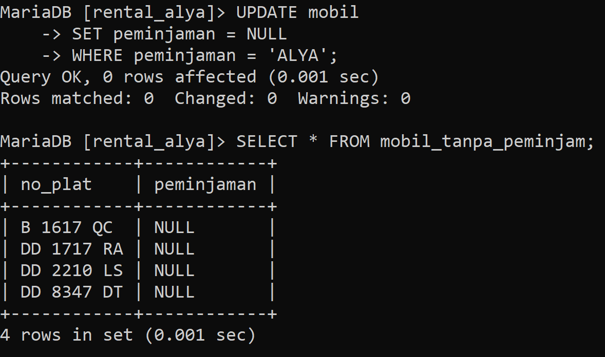

### Kesimpulan
`UPDATE mobil SET peminjaman = NULL WHERE peminjaman = 'ALYA';` nilai pada kolom peminjaman pada tabel `mobil`yang memiliki nilai 'ALYA' akan diubah menjadi NULL.
Kesimpulannya, perintah digunakan untuk menghapus atau mengubah nilai peminjaman menjadi NULL untuk semua data di tabel mobil yang berada di kolom `peminjaman`memiliki nilai 'ALYA'.

SELECT * FROM mobil_tanpa_peminjam; digunakan untuk menampilkan semua data dari view mobil_tanpa_peminjam, yang telah dibuat sebelumnya dengan mengubah atau menghapus nilai peminjam menjadi NULL untuk tabel mobil dimana peminjam memiliki nilai ALYA.
## Nomor 3
View digunakan untuk menyaring data sesuai dengan kriteria tertentu, seperti menampilkan data yang memiliki nilai NULL pada kolom tertentu atau mengubah salah satu data peminjaman menjadi NULL. Memberikan pandangan yang jelas tentang mobil yang tersedia untuk disewakan atau yang belum memiliki peminjam.
Dengan membuat view, kita dapat membatasi akses ke data sensitif atau kolom tertentu dari tabel yang mungkin tidak perlu diakses oleh semua pengguna.
Dengan membuat view untuk kueri yang sering digunakan, Anda dapat menghindari pengulangan kode SQL yang sama di beberapa tempat dalam aplikasi atau prosedur penyimpanan.
# AGREGASI
## SUM
### Penjelasan
- `SELECT SUM(harga_rental)` : Fungsi `SUM()` digunakan untuk menghitung total atau jumlah dari semua nilai dalam kolom `harga_rental`.
- `FROM mobil` : Menentukan tabel `mobil` dari mana data akan diambil.
### Struktur Query
```mysql
SELECT SUM(nama_kolom) FROM nama_tabel;
```
### Contoh Query
```mysql
SELECT SUM(harga_rental) FROM mobil;
```
### Hasil
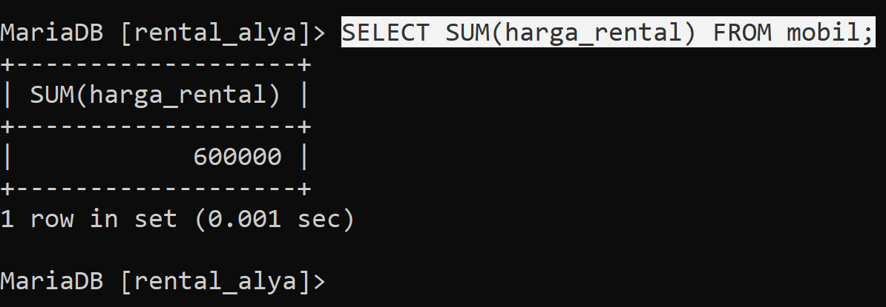

### Kesimpulan
Query  `SELECT SUM(harga_rental) FROM mobil;` akan menghitung dan menampilkan total atau jumlah keseluruhan dari nilai-nilai yang terdapat pada kolom `harga_rental` di dalam tabel `mobil`. Hasil query ini akan memberikan informasi total atau keseluruhan harga rental untuk semua mobil yang ada di dalam tabel tersebut.
## Count
### Penjelasan
PENJELASAN 1
- `SELECT COUNT(pemilik)` - Fungsi `COUNT()` digunakan untuk menghitung jumlah baris atau record yang ada di dalam kolom `pemilik`.
- `FROM mobil` - Menentukan tabel `mobil` dari mana data akan diambil.

PENJELASAN 2
- `SELECT COUNT(peminjaman)` - Fungsi `COUNT()` digunakan untuk menghitung jumlah baris atau record yang ada di dalam kolom `peminjaman`.
- `FROM mobil` - Menentukan tabel `mobil` dari mana data akan diambil.
### Struktur Query
```mysql
SELECT COUNT(nama_kolom) FROM nama_tabel;

SELECT COUNT(nama_kolom) FROM nama_tabel;
```
### Contoh Query
```mysql
SELECT COUNT(pemilik) FROM mobil;

SELECT COUNT(peminjaman) FROM mobil;
```
### Hasil
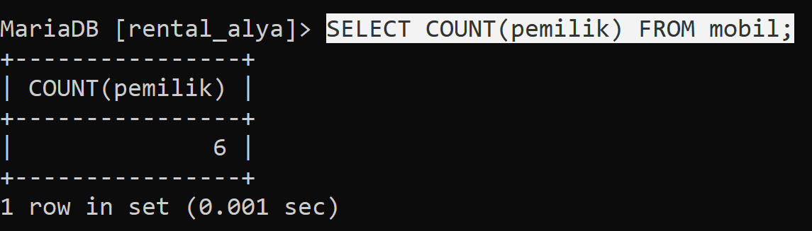
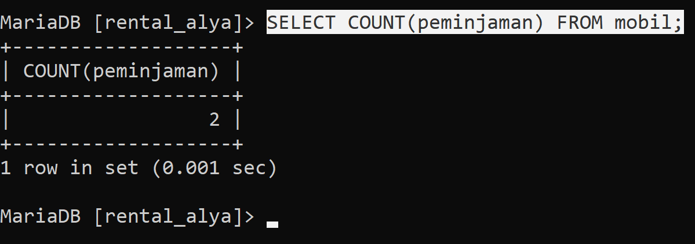
### Kesimpulan
KESIMPULAN 1
Query `SELECT COUNT(pemilik) FROM mobil;` akan menghitung dan menampilkan jumlah total pemilik mobil yang ada di dalam tabel `mobil`. Hasil query ini akan memberikan informasi tentang berapa banyak pemilik mobil yang tercatat di dalam tabel tersebut.

KESIMPULAN 2
Query `SELECT COUNT(peminjaman) FROM mobil;` akan menghitung dan menampilkan jumlah total peminjaman mobil yang ada di dalam tabel `mobil`. Hasil query ini akan memberikan informasi tentang berapa banyak peminjaman mobil yang tercatat di dalam tabel tersebut.
## MIN
### Penjelasan
- `SELECT MIN(harga_rental)` : Fungsi `MIN()` digunakan untuk mencari nilai minimum (terkecil) dari kolom `harga_rental`.
- `AS MINIMAL` : Hasil dari fungsi `MIN()` akan ditampilkan dengan nama alias "MINIMAL".
- `FROM mobil` : Menentukan tabel `mobil` dari mana data akan diambil.
### Struktur Query
```mysql
SELECT MIN(nama_kolom) AS nilai_minimum FROM nama_tabel;
```
### Contoh Query
```mysql
SELECT MIN(harga_rental) AS MINIMAL FROM mobil;
```
### Hasil
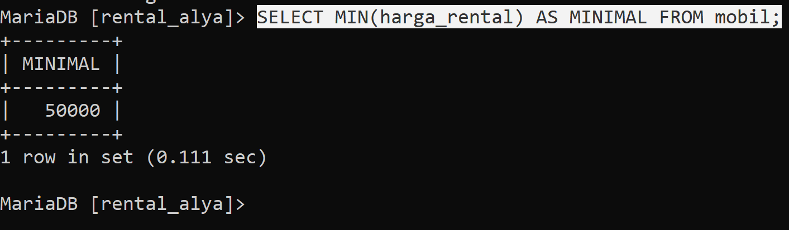

### Kesimpulan
Query `SELECT MIN(harga_rental) AS MINIMAL FROM mobil;` akan mencari dan menampilkan harga rental mobil yang paling murah atau terkecil dari semua data yang ada di dalam tabel `mobil`. Hasil query ini akan memberikan informasi tentang harga rental mobil terendah yang tercatat di dalam tabel tersebut.
## MAX
### Penjelasan
- `SELECT MAX(harga_rental)` : Fungsi `MAX()` digunakan untuk mencari nilai maksimum (terbesar) dari kolom `harga_rental`.
- `AS MAXIMAL` : Hasil dari fungsi `MAX()` akan ditampilkan dengan nama alias "MAXIMAL".
- `FROM mobil` : Menentukan tabel `mobil` dari mana data akan diambil.
### Struktur Query
```mysql
SELECT MAX(nama_kolom) AS nilai_minimum FROM nama_tabel;
```
### Contoh Query
```mysql
SELECT MAX(harga_rental) AS MAXIMAL FROM mobil;
```
### Hasil
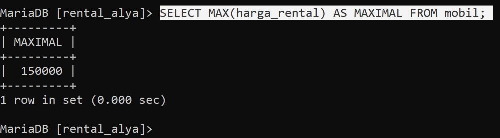

### Kesimpulan
Query `SELECT MAX(harga_rental) AS MAXIMAL FROM mobil;` akan mencari dan menampilkan harga rental mobil yang paling mahal atau terbesar dari semua data yang ada di dalam tabel `mobil`. Hasil query ini akan memberikan informasi tentang harga rental mobil tertinggi yang tercatat di dalam tabel tersebut.
## AVG
### Penjelasan
- `SELECT AVG(harga_rental)` : Fungsi `AVG()` digunakan untuk menghitung rata-rata (average) dari nilai-nilai pada kolom `harga_rental`.
- `AS RATA_RATA` : Hasil dari fungsi `AVG()` akan ditampilkan dengan nama alias "RATA_RATA".
- `FROM mobil` : Menentukan tabel `mobil` dari mana data akan diambil.
### Struktur Query
```mysql
SELECT AVG(nama_kolom) AS rata_rata FROM nama_tabel;
```
### Contoh Query
```mysql
SELECT AVG(harga_rental) AS RATA_RATA FROM mobil;
```
### Hasil
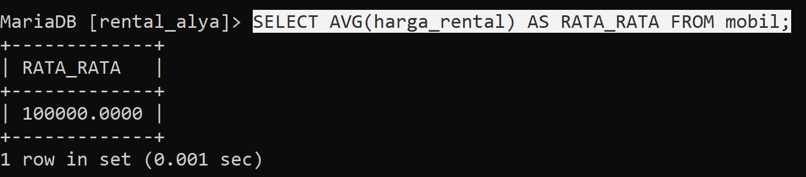

### Kesimpulan
Query `SELECT AVG(harga_rental) AS RATA_RATA FROM mobil;` akan menghitung dan menampilkan rata-rata (average) harga rental mobil dari semua data yang ada di dalam tabel `mobil`. Hasil query ini akan memberikan informasi tentang harga rental mobil rata-rata yang tercatat di dalam tabel tersebut.

